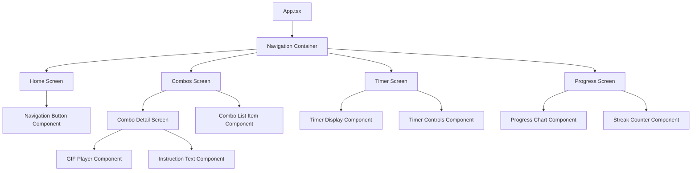
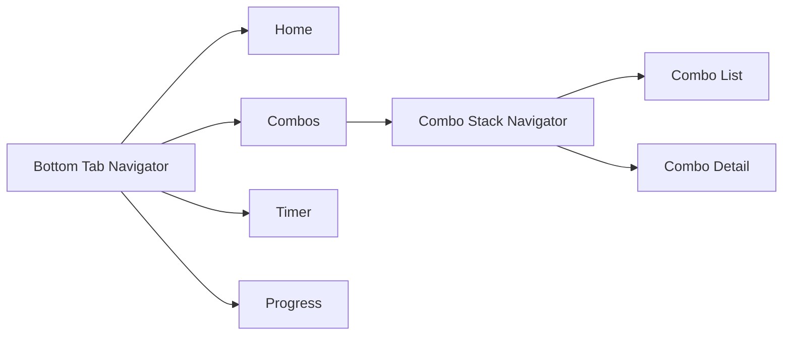
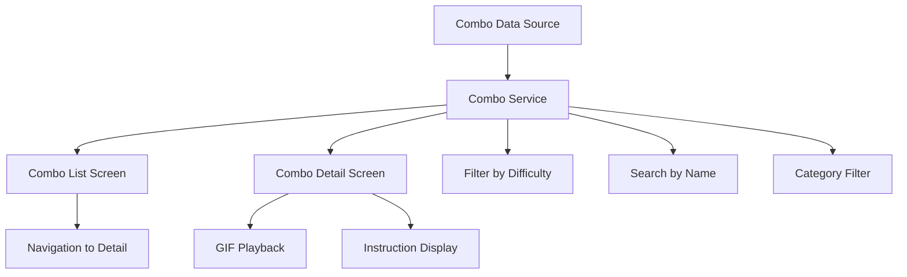
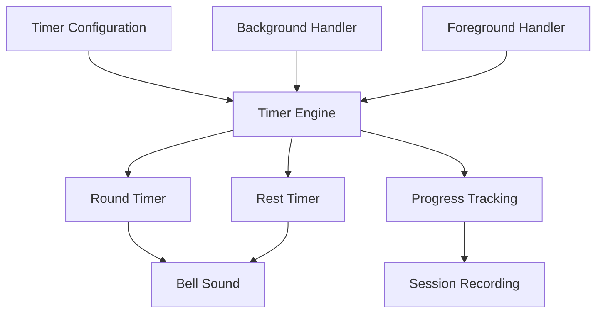
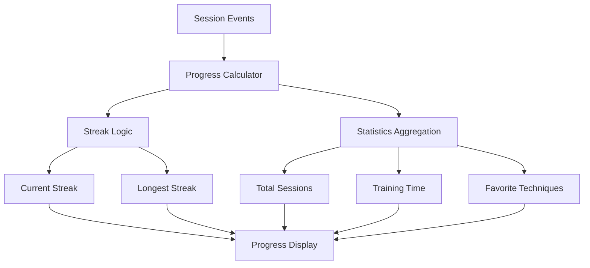

# Nak Muay Trainer - Mobile Fitness App Design

## Overview

**Nak Muay Trainer** is a React Native mobile application designed to help users practice Muay Thai techniques and conditioning exercises. The app provides an interactive training experience with combo demonstrations, customizable timers, and progress tracking to support practitioners of all levels.

### Key Value Propositions
- **Accessible Training**: Practice Muay Thai techniques anywhere without requiring a gym or trainer
- **Visual Learning**: Stick figure GIF demonstrations for clear technique visualization
- **Structured Practice**: Configurable round timers mimicking real training sessions
- **Progress Motivation**: Track training streaks and completed sessions

## Technology Stack & Dependencies

### Core Framework
- **React Native**: Cross-platform mobile development
- **Expo**: Development platform and runtime for React Native
- **TypeScript**: Type safety and enhanced development experience

### Navigation & State Management
- **@react-navigation/native**: Screen navigation
- **@react-navigation/stack**: Stack-based navigation
- **React Context API**: Global state management for user progress

### Storage & Data Persistence
- **@react-native-async-storage/async-storage**: Local data persistence
- **expo-file-system**: File system access for assets

### UI & Styling
- **nativewind**: Tailwind CSS for React Native
- **react-native-vector-icons**: Icon library
- **expo-linear-gradient**: Gradient backgrounds

### Media & Assets
- **expo-av**: Audio playback for timer bells
- **react-native-fast-image**: Optimized GIF rendering

### Charts & Visualization
- **react-native-chart-kit**: Progress charts and statistics

## Component Architecture

### Screen Components



### Component Hierarchy

#### Core Navigation Structure
- **App Component**: Root component with navigation setup
- **TabNavigator**: Bottom tab navigation for main screens
- **StackNavigator**: Nested stack for combo details

#### Reusable UI Components
- **PrimaryButton**: Styled action buttons with Thai boxing theme
- **Card**: Container component for content sections
- **TimerDisplay**: Large digital timer with customizable appearance
- **ProgressIndicator**: Visual progress bars and counters

### Component Definitions

#### HomeScreen Component
```typescript
interface HomeScreenProps {
  navigation: NavigationProp<any>;
}

// Features:
// - App branding and introduction
// - Quick navigation to main features
// - Daily motivation message
```

#### CombosScreen Component
```typescript
interface CombosScreenProps {
  navigation: NavigationProp<any>;
}

interface ComboItem {
  id: string;
  name: string;
  difficulty: 'Beginner' | 'Intermediate' | 'Advanced';
  gifPath: string;
  instructions: string[];
  category: 'Punches' | 'Kicks' | 'Elbows' | 'Knees' | 'Combos';
}
```

#### TimerScreen Component
```typescript
interface TimerConfig {
  rounds: number;
  roundDuration: number; // seconds
  restDuration: number; // seconds
  bellEnabled: boolean;
}

interface TimerState {
  currentRound: number;
  timeRemaining: number;
  isActive: boolean;
  isResting: boolean;
}
```

#### ProgressScreen Component
```typescript
interface UserProgress {
  totalSessions: number;
  currentStreak: number;
  longestStreak: number;
  lastSessionDate: string;
  sessionHistory: SessionRecord[];
}

interface SessionRecord {
  id: string;
  date: string;
  type: 'combo' | 'timer' | 'mixed';
  duration: number; // minutes
  details: any;
}
```

## Routing & Navigation

### Navigation Structure



### Route Definitions
- **Home** (`/`): Main landing screen
- **Combos** (`/combos`): Technique library
- **ComboDetail** (`/combos/:id`): Individual technique detail
- **Timer** (`/timer`): Round timer functionality
- **Progress** (`/progress`): User statistics and achievements

### Navigation Parameters
```typescript
type RootStackParamList = {
  Home: undefined;
  Combos: undefined;
  ComboDetail: { comboId: string };
  Timer: undefined;
  Progress: undefined;
};
```

## Styling Strategy

### Design System

#### Color Palette
```typescript
const colors = {
  // Primary Thai boxing colors
  primary: '#DC2626', // Bold red
  secondary: '#FFFFFF', // Pure white
  accent: '#F59E0B', // Gold accents
  
  // Background colors
  background: '#111827', // Dark background
  surface: '#1F2937', // Card backgrounds
  
  // Text colors
  textPrimary: '#FFFFFF',
  textSecondary: '#9CA3AF',
  
  // Status colors
  success: '#10B981',
  warning: '#F59E0B',
  error: '#EF4444'
};
```

#### Typography Scale
```typescript
const typography = {
  // Headers
  h1: { fontSize: 32, fontWeight: 'bold', color: colors.textPrimary },
  h2: { fontSize: 24, fontWeight: '600', color: colors.textPrimary },
  h3: { fontSize: 20, fontWeight: '600', color: colors.textPrimary },
  
  // Body text
  body: { fontSize: 16, fontWeight: 'normal', color: colors.textPrimary },
  caption: { fontSize: 14, fontWeight: 'normal', color: colors.textSecondary },
  
  // Special
  timer: { fontSize: 48, fontWeight: 'bold', color: colors.primary }
};
```

#### Spacing System
```typescript
const spacing = {
  xs: 4,
  sm: 8,
  md: 16,
  lg: 24,
  xl: 32,
  xxl: 48
};
```

### Component Styling Patterns

#### Card Components
```typescript
const cardStyles = {
  container: {
    backgroundColor: colors.surface,
    borderRadius: 12,
    padding: spacing.md,
    marginBottom: spacing.md,
    shadowColor: '#000',
    shadowOffset: { width: 0, height: 2 },
    shadowOpacity: 0.1,
    shadowRadius: 4,
    elevation: 3
  }
};
```

#### Button Components
```typescript
const buttonStyles = {
  primary: {
    backgroundColor: colors.primary,
    paddingVertical: spacing.md,
    paddingHorizontal: spacing.lg,
    borderRadius: 8,
    alignItems: 'center'
  },
  secondary: {
    backgroundColor: 'transparent',
    borderWidth: 2,
    borderColor: colors.primary,
    paddingVertical: spacing.md,
    paddingHorizontal: spacing.lg,
    borderRadius: 8,
    alignItems: 'center'
  }
};
```

## State Management

### Context Providers

#### ProgressContext
```typescript
interface ProgressContextType {
  userProgress: UserProgress;
  updateProgress: (session: SessionRecord) => void;
  resetProgress: () => void;
  getStreak: () => number;
}

// Provides global access to user progress data
// Handles persistence to AsyncStorage
// Manages streak calculations and session tracking
```

#### TimerContext
```typescript
interface TimerContextType {
  timerConfig: TimerConfig;
  updateTimerConfig: (config: Partial<TimerConfig>) => void;
  currentSession: TimerSession | null;
  startSession: () => void;
  pauseSession: () => void;
  endSession: () => void;
}

// Manages timer state across app navigation
// Handles background timer continuation
// Persists timer preferences
```

### Local State Patterns

#### Screen-Level State
- Form inputs and validation
- Loading states and UI feedback
- Modal and overlay visibility
- Temporary data before persistence

#### Component-Level State
- Animation states
- Gesture handling
- Media playback state
- UI interaction feedback

## Data Models & Storage

### AsyncStorage Schema

#### User Progress
```typescript
// Key: 'userProgress'
interface StoredProgress {
  totalSessions: number;
  currentStreak: number;
  longestStreak: number;
  lastSessionDate: string; // ISO string
  sessionHistory: SessionRecord[]; // Last 30 sessions
}
```

#### Timer Configuration
```typescript
// Key: 'timerConfig'
interface StoredTimerConfig {
  rounds: number;
  roundDuration: number;
  restDuration: number;
  bellEnabled: boolean;
  lastUsed: string;
}
```

#### App Preferences
```typescript
// Key: 'appPreferences'
interface AppPreferences {
  hasCompletedOnboarding: boolean;
  soundEnabled: boolean;
  notificationsEnabled: boolean;
  preferredDifficulty: 'Beginner' | 'Intermediate' | 'Advanced';
}
```

### Data Access Layer

#### Storage Service
```typescript
class StorageService {
  static async getProgress(): Promise<UserProgress>;
  static async saveProgress(progress: UserProgress): Promise<void>;
  static async getTimerConfig(): Promise<TimerConfig>;
  static async saveTimerConfig(config: TimerConfig): Promise<void>;
  static async clearAllData(): Promise<void>;
}
```

## Business Logic Layer

### Core Features Architecture

#### Combo Management System


**ComboService Responsibilities:**
- Load combo definitions from static data
- Filter and search functionality
- Track combo completion
- Provide difficulty progression suggestions

#### Timer System Architecture


**TimerService Responsibilities:**
- Manage round and rest intervals
- Handle background/foreground transitions
- Audio playback for bell sounds
- Session time tracking and recording

#### Progress Tracking System


**ProgressService Responsibilities:**
- Calculate training streaks with date logic
- Aggregate session statistics
- Generate motivational insights
- Handle data migration and cleanup

### Core Service Classes

#### ComboService
```typescript
class ComboService {
  static getAllCombos(): ComboItem[];
  static getComboById(id: string): ComboItem | null;
  static getCombosbyCategory(category: string): ComboItem[];
  static searchCombos(query: string): ComboItem[];
  static markComboCompleted(comboId: string): Promise<void>;
}
```

#### TimerService
```typescript
class TimerService {
  static createSession(config: TimerConfig): TimerSession;
  static startTimer(session: TimerSession): void;
  static pauseTimer(session: TimerSession): void;
  static resetTimer(session: TimerSession): void;
  static playBellSound(): Promise<void>;
}
```

#### ProgressService
```typescript
class ProgressService {
  static recordSession(session: SessionRecord): Promise<void>;
  static calculateStreak(sessions: SessionRecord[]): number;
  static getWeeklyStats(): WeeklyStats;
  static getMonthlyStats(): MonthlyStats;
  static getMilestones(): Milestone[];
}
```

## API Integration Layer

### Static Data Management

#### Combo Definitions
```typescript
// Located in /assets/data/combos.json
interface ComboDefinition {
  id: string;
  name: string;
  category: ComboCategory;
  difficulty: DifficultyLevel;
  instructions: string[];
  gifFileName: string;
  tips: string[];
  commonMistakes: string[];
  nextCombos: string[]; // Suggested progression
}
```

#### Asset Management
```typescript
class AssetService {
  static getComboGif(fileName: string): any; // require() path
  static preloadAssets(): Promise<void>;
  static getBellSound(): any;
  static getMotivationalImages(): any[];
}
```

### Future API Readiness

#### User Sync Service (Future Enhancement)
```typescript
// Prepared for cloud sync functionality
interface SyncService {
  syncProgress(localProgress: UserProgress): Promise<UserProgress>;
  syncSettings(localSettings: AppPreferences): Promise<AppPreferences>;
  uploadSession(session: SessionRecord): Promise<void>;
  downloadUpdatedCombos(): Promise<ComboDefinition[]>;
}
```

## Testing Strategy

### Unit Testing Framework

#### Test Configuration
- **Jest**: JavaScript testing framework
- **React Native Testing Library**: Component testing utilities
- **@testing-library/jest-native**: Native-specific matchers

#### Component Testing Patterns
```typescript
// Example: Timer component testing
describe('TimerDisplay', () => {
  test('displays time in MM:SS format', () => {
    render(<TimerDisplay seconds={125} />);
    expect(screen.getByText('02:05')).toBeOnTheScreen();
  });
  
  test('shows different color when time is low', () => {
    const { rerender } = render(<TimerDisplay seconds={30} />);
    expect(screen.getByTestId('timer-display')).toHaveStyle({
      color: colors.warning
    });
  });
});
```

#### Service Layer Testing
```typescript
// Example: Progress service testing
describe('ProgressService', () => {
  beforeEach(() => {
    jest.clearAllMocks();
    AsyncStorage.clear();
  });
  
  test('calculates streak correctly across dates', () => {
    const sessions = createMockSessions(['2023-10-01', '2023-10-02', '2023-10-03']);
    const streak = ProgressService.calculateStreak(sessions);
    expect(streak).toBe(3);
  });
  
  test('resets streak after gap', () => {
    const sessions = createMockSessions(['2023-10-01', '2023-10-03']);
    const streak = ProgressService.calculateStreak(sessions);
    expect(streak).toBe(1);
  });
});
```

#### Integration Testing
```typescript
// Example: Navigation flow testing
describe('Navigation Flow', () => {
  test('navigates from home to combo detail', async () => {
    const navigation = createMockNavigation();
    render(<App />);
    
    fireEvent.press(screen.getByText('Combos'));
    await waitFor(() => {
      expect(screen.getByText('Jab-Cross')).toBeOnTheScreen();
    });
    
    fireEvent.press(screen.getByText('Jab-Cross'));
    await waitFor(() => {
      expect(screen.getByTestId('combo-gif')).toBeOnTheScreen();
    });
  });
});
```

### Test Coverage Goals
- **Component Tests**: 90%+ coverage for all UI components
- **Service Tests**: 95%+ coverage for business logic
- **Integration Tests**: Critical user flows
- **Snapshot Tests**: UI consistency verification

### Mock Strategies

#### AsyncStorage Mocking
```typescript
jest.mock('@react-native-async-storage/async-storage', () =>
  require('@react-native-async-storage/async-storage/jest/async-storage-mock')
);
```

#### Navigation Mocking
```typescript
const mockNavigation = {
  navigate: jest.fn(),
  goBack: jest.fn(),
  reset: jest.fn(),
};
```

#### Timer Mocking
```typescript
jest.useFakeTimers();
// Control timer behavior in tests
```

## File Structure

```
src/
├── components/
│   ├── common/
│   │   ├── Button.tsx
│   │   ├── Card.tsx
│   │   ├── LoadingSpinner.tsx
│   │   └── ProgressBar.tsx
│   ├── timer/
│   │   ├── TimerDisplay.tsx
│   │   ├── TimerControls.tsx
│   │   └── RoundIndicator.tsx
│   └── combo/
│       ├── ComboCard.tsx
│       ├── GifPlayer.tsx
│       └── InstructionList.tsx
├── screens/
│   ├── HomeScreen.tsx
│   ├── CombosScreen.tsx
│   ├── ComboDetailScreen.tsx
│   ├── TimerScreen.tsx
│   └── ProgressScreen.tsx
├── services/
│   ├── ComboService.ts
│   ├── TimerService.ts
│   ├── ProgressService.ts
│   └── StorageService.ts
├── context/
│   ├── ProgressContext.tsx
│   └── TimerContext.tsx
├── types/
│   ├── combo.ts
│   ├── timer.ts
│   └── progress.ts
├── utils/
│   ├── dateHelpers.ts
│   ├── formatters.ts
│   └── constants.ts
├── assets/
│   ├── muaythai/
│   │   ├── jab-cross.gif
│   │   ├── teep.gif
│   │   ├── elbow.gif
│   │   └── roundhouse.gif
│   ├── sounds/
│   │   └── bell.mp3
│   └── data/
│       └── combos.json
└── navigation/
    ├── AppNavigator.tsx
    ├── TabNavigator.tsx
    └── StackNavigator.tsx
```