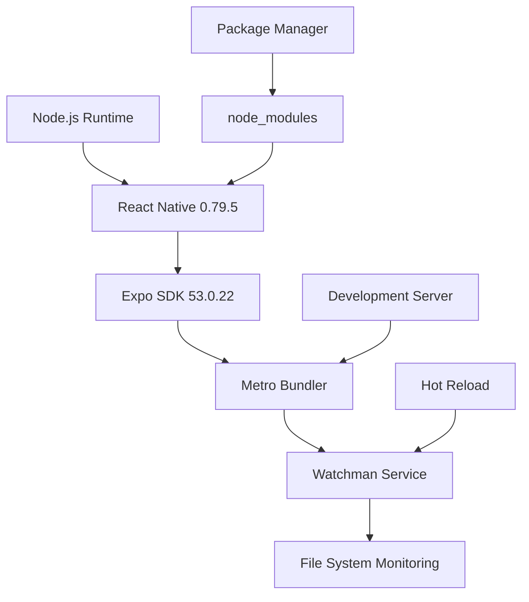
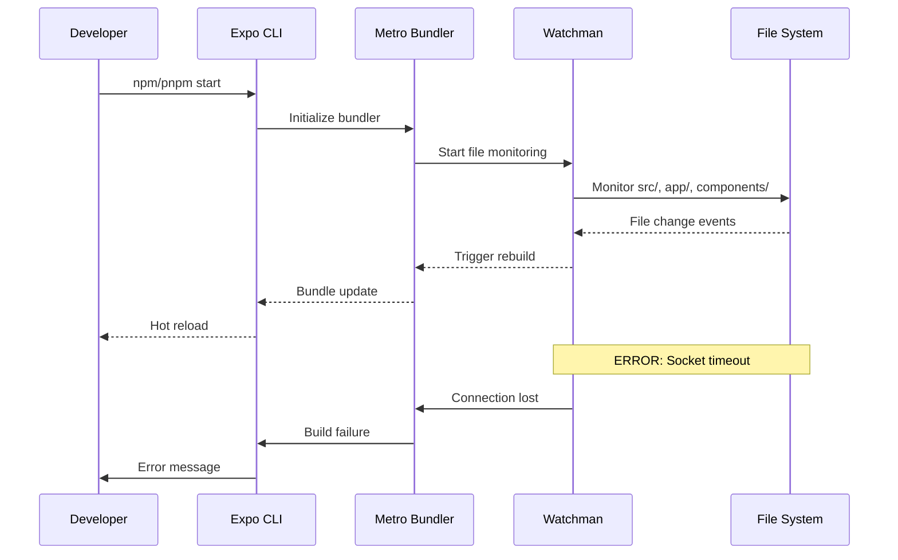
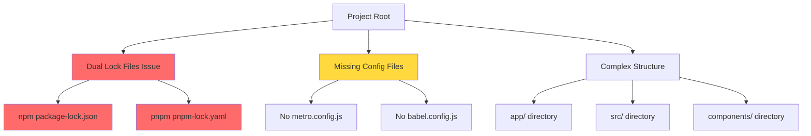
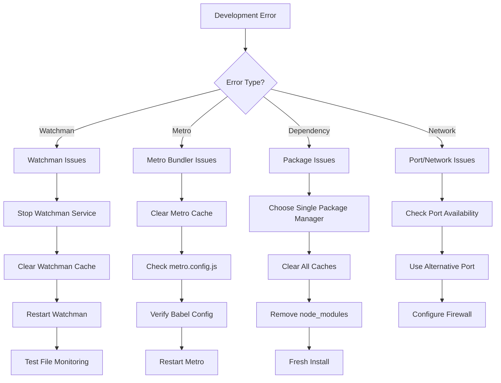
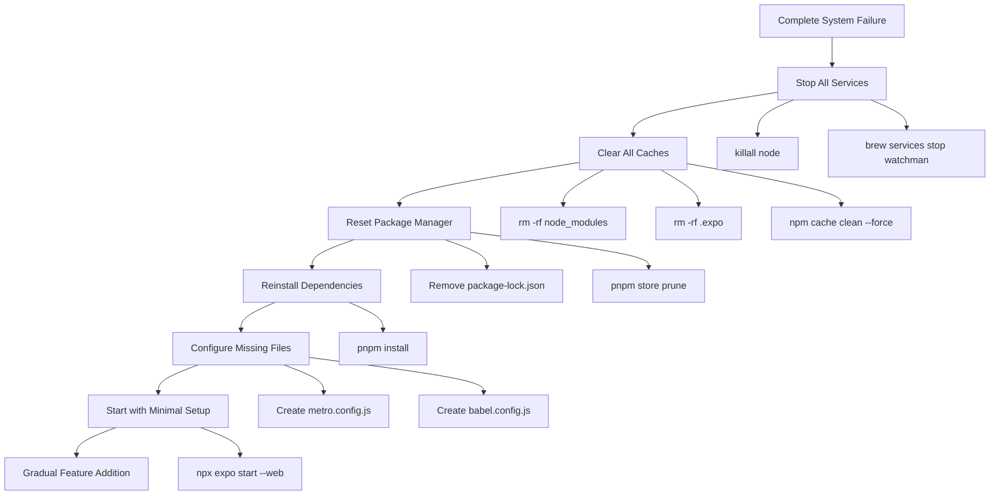

# Root Cause Analysis: Muay Thai Training App Development Issues

## Overview

This document provides a comprehensive root cause analysis of the persistent errors and failures affecting the Muay Thai training application during development. The analysis focuses on Watchman errors, development server failures, and overall application stability issues.

## Problem Statement

The Muay Thai training app (built with React Native and Expo) is experiencing continuous development issues including:
- Watchman service errors and timeouts
- Development server startup failures  
- Application runtime instability
- Build process interruptions
- Hot reload and fast refresh malfunctions

## Technology Stack Analysis

### Current Configuration
- **React Native**: 0.79.5
- **Expo SDK**: ~53.0.22  
- **Node.js**: Version dependency unknown
- **Package Manager**: Mixed (pnpm, npm)
- **Metro Bundler**: Default Expo configuration
- **Watchman**: System-level file watcher

### Dependencies Audit


## Root Cause Categories

### 1. Watchman Service Issues

**Primary Symptoms:**
- Socket connection timeouts
- File watching service failures
- Development server startup delays
- Hot reload interruptions

**Root Causes:**
- **Corrupted Watchman state**: Accumulated cache and state corruption
- **Permission conflicts**: Insufficient file system access permissions  
- **Resource exhaustion**: Memory and file descriptor limits
- **Version incompatibility**: Watchman version conflicts with React Native/Metro

**Impact Analysis:**
- Blocks development workflow
- Prevents hot reload functionality
- Causes frequent server restarts
- Degrades developer experience significantly

### 2. Configuration Management Issues

**Missing Configuration Files:**
- No `metro.config.js` found
- No `babel.config.js` found  
- Default Expo configurations may be insufficient

**Configuration Conflicts:**
- Mixed package managers (npm + pnpm)
- Potential version mismatches
- TypeScript path resolution issues
- NativeWind integration conflicts

**Environment Variables:**
- Unclear development environment setup
- Missing platform-specific configurations
- Potential port conflicts

### 3. Dependency Management Problems

**Package Manager Conflicts:**
- `package-lock.json` (npm) and `pnpm-lock.yaml` present simultaneously
- Inconsistent dependency resolution
- Cache conflicts between package managers

**Version Compatibility:**
- React Native 0.79.5 with Expo SDK 53.0.22 compatibility
- NativeWind 4.1.23 integration issues
- Chart-kit and SVG dependencies potential conflicts

### 4. System-Level Issues

**File System Monitoring:**
- macOS file system case sensitivity
- File descriptor limits
- Permission restrictions in development directory

**Network Configuration:**
- Port binding conflicts (8081, 8082)
- Firewall restrictions
- Localhost resolution issues

## Architecture-Level Analysis

### Development Server Flow


### Current Project Structure Issues


## Diagnostic Framework

### Error Classification Matrix

| Error Type | Severity | Frequency | Recovery Time | Root Cause Category |
|------------|----------|-----------|---------------|-------------------|
| Watchman Socket Timeout | Critical | High | 2-5 minutes | System/Service |
| Metro Build Failure | High | Medium | 1-2 minutes | Configuration |
| Hot Reload Failure | Medium | High | 30 seconds | File Monitoring |
| Dependency Resolution | High | Low | 5-10 minutes | Package Management |
| Port Binding Error | Medium | Low | 1 minute | Network |

### Troubleshooting Decision Tree


## Solution Architecture

### 1. Watchman Service Stabilization

**Service Management:**
```bash
# Complete Watchman reset procedure
brew services stop watchman
watchman shutdown-server
rm -rf ~/.watchman/
brew services start watchman
```

**Backup Strategy:**
- Use `EXPO_OFFLINE=1` for development without Watchman
- Implement manual refresh workflow as fallback
- Configure alternative file monitoring solutions

### 2. Configuration Standardization

**Required Configuration Files:**

**metro.config.js:**
```javascript
const { getDefaultConfig } = require('expo/metro-config');
const config = getDefaultConfig(__dirname);

// NativeWind configuration
config.transformer.babelTransformerPath = require.resolve('nativewind/babel');

module.exports = config;
```

**babel.config.js:**
```javascript
module.exports = function(api) {
  api.cache(true);
  return {
    presets: ['babel-preset-expo'],
    plugins: ['nativewind/babel'],
  };
};
```

### 3. Package Management Cleanup

**Standardization Strategy:**
```bash
# Remove conflicting lock files
rm package-lock.json
rm -rf node_modules

# Use single package manager (pnpm)
pnpm install
pnpm store prune
```

**Version Alignment:**
- Verify React Native 0.79.5 compatibility with Expo 53.0.22
- Update AsyncStorage to compatible version: 2.1.2
- Ensure NativeWind 4.1.23 proper integration

### 4. Development Environment Optimization

**Environment Setup:**
```bash
# Set development environment variables
export EXPO_OFFLINE=1          # For Watchman bypass
export EXPO_USE_HERMES=true    # Enable Hermes engine
export NODE_ENV=development    # Explicit development mode
```

**Alternative Startup Commands:**
```bash
# Primary: Standard startup
npx expo start --web --clear

# Fallback: Offline mode
EXPO_OFFLINE=1 npx expo start --web --clear

# Network issues: Tunnel mode  
npx expo start --tunnel

# Port conflicts: Alternative port
npx expo start --port 8082
```

## Recovery Procedures

### Emergency Recovery Protocol


### Progressive Testing Strategy

**Phase 1: Core Validation**
- Metro bundler initialization
- Basic TypeScript compilation
- Simple component rendering

**Phase 2: Service Integration**
- Watchman file monitoring
- Hot reload functionality  
- Navigation system

**Phase 3: Full Feature Testing**
- Timer components
- Progress tracking
- Data persistence

## Monitoring and Prevention

### Health Check Framework

**Automated Diagnostics:**
```bash
#!/bin/bash
# development-health-check.sh

echo "=== Development Environment Health Check ==="

# Check Node.js version
echo "Node.js: $(node --version)"

# Check Watchman status
echo "Watchman: $(watchman version 2>/dev/null || echo 'Not running')"

# Check port availability  
echo "Port 8081: $(lsof -ti:8081 && echo 'In use' || echo 'Available')"

# Check package manager consistency
if [[ -f "package-lock.json" && -f "pnpm-lock.yaml" ]]; then
    echo "WARNING: Multiple lock files detected"
fi

# Check critical config files
[[ -f "metro.config.js" ]] && echo "Metro config: Present" || echo "Metro config: Missing"
[[ -f "babel.config.js" ]] && echo "Babel config: Present" || echo "Babel config: Missing"

echo "=== Health Check Complete ==="
```

### Proactive Monitoring

**File System Monitoring:**
- Track node_modules size and integrity
- Monitor .expo cache directory growth
- Watch for permission changes

**Service Monitoring:**  
- Watchman service health checks
- Metro bundler memory usage
- Development server response times

## Implementation Roadmap

### Phase 1: Immediate Fixes (Day 1)
1. Stop all development services
2. Clean package management (choose pnpm exclusively)
3. Create missing configuration files
4. Implement emergency recovery procedures

### Phase 2: Stabilization (Days 2-3)
1. Configure Watchman properly or implement bypass
2. Test all development workflows
3. Validate hot reload functionality
4. Document working configuration

### Phase 3: Optimization (Days 4-5)
1. Implement monitoring scripts
2. Create automated health checks
3. Optimize development performance
4. Establish prevention protocols

### Phase 4: Documentation (Day 6)
1. Update development setup documentation
2. Create troubleshooting guides
3. Establish team development standards
4. Implement CI/CD health checks


